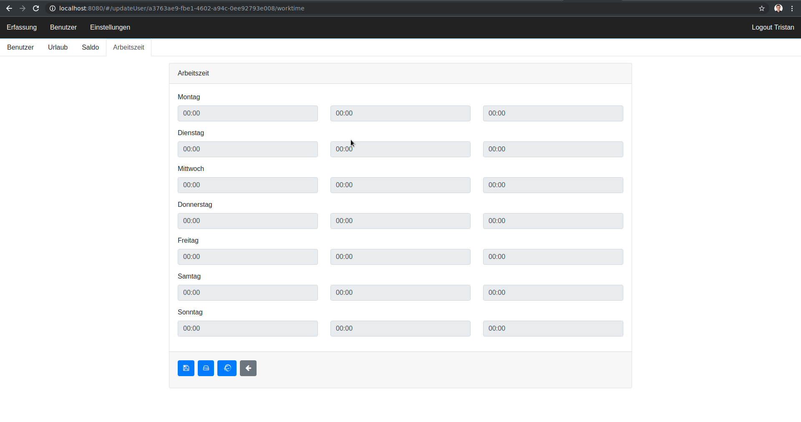

# react-track

A simple timetracking tool with reactjs and lowdb.

# Motivation

A customer of mine was looking for a very simple timetracking application which runs in the web and is responsive on mobile. His idea was that every employee could book and check their times with their mobile device.

Since we couldn't find a software with modern technology and a effortable price we created our own tool.

# Stack

This lists the essential technology stack the application uses.

## Frontend 

- [**Typescript**](https://www.typescriptlang.org/) Javascript that scales (ES++ with types)
- [**React**](https://facebook.github.io/react/) view layer
- [**reactstrap**](https://reactstrap.github.io/) bootstrap 4 components for react
- [**bootstraps**](https://v4-alpha.getbootstrap.com/) bootstrap 4 css
- [**recharts**](https://github.com/recharts/recharts) chart library built with React and D3
- [**apollo-client**](https://github.com/apollographql/apollo-client) full featured GraphQL client
- [**moment**](https://momentjs.com/) Parse, validate, manipulate, and display dates and times in JavaScript.

## Backend

- [**Typescript**](https://www.typescriptlang.org/) Javascript that scales (ES++ with types)
- [**expressJS**](https://github.com/expressjs) Fast, unopinionated, minimalist web framework for node
- [**apollo-server-express**](https://github.com/apollographql/apollo-server) production ready graphql server for express
- [**lowdb**](https://github.com/typicode/lowdb) lowdb is a small local JSON database powered by Lodash
- [**moment**](https://momentjs.com/) Parse, validate, manipulate, and display dates and times in JavaScript.

## Tool-Chain

- [**webpack**](https://webpack.js.org/) module bundler

## Formatting, Linter

- [**eslint**](https://eslint.org/) linter for typescript
- [**prettier**](https://github.com/prettier/prettier) prettier

## Testing

- [**Jest**](https://facebook.github.io/jest/) for testing, mocking and coverage report
- [**ts-jest**](https://github.com/kulshekhar/ts-jest) typescript preprocessor for Jest
- [**enzyme**](https://github.com/airbnb/enzyme) create unit tests for react

# Development

## Script jobs

```bash
npm run / yarn
start:web+server ------ start web app and server
test ------------------ runs tests with coverage reports
build-web ------------- build web app
build-server ---------- build server app
```

# Documentation

## 01 Create User


Login with admin-pw qwer1234


- Name: Name of the user (used for login)
- Code: Code / pw of the user (used for login)
- Role: Role of the user. there are three roles:
    - Admin: Can create / update / delete other users
    - User: Active user, allowed to login an track times
    - Gast: Inactive user
- Startdate: Date when the User starts (will be used for calculating the yearly saldo)


- Set how many vacation days the user has for the selected year.


- Define the yearly saldo in hours with which the user starts. Can be positive or negative. We used this feature for migrating from our old timetracking app, we also need it to switch in another year.
E.g. if someone has plus hours or minus hours.



- Define the worktime of the user, means when is he allowed to work.
Set starttime, endtime and the saldo he has to achieve.
If he is allowed to work 24h simply leave 0 in both fields.

- There are two safe buttons, you can save only for the current user or for all users.

- The application has two timestamps a billed time (worktimes) and the actual time. If a user is allowed to start at 9am but he already started at 7am the actual time was 7am but the billed time was 9am. 

- With the third button you can re-write the billed time with the actual time if you change the worktimes afterwards.

## 02 Settings


Breaks
- You can define automatic breaks, basically you can say after X hours the application substracts Y minutes from the worked time. By adding a break.

Worktime Settings
- You can define if Public Holidays, School, Vacation, Illness is paid or not paid time.

Public Holidays
- Define public holidays, currently you can load german public holidays automaticall by clicking the refresh icon.

## 03 Users


Buttons on the user-row from left to right:

- Creates printable report for selected user
- Holiday module
- Booking Overview
- Edit user
- Delete user

On the left bottom side there is:

- Create user
- Create printable report for all users

## 04 Time Tracking


Simply tab/click to create a booking. The booking will switch between come and go

## 05 Report


You can create a printable report for the selected user or for all users on the users overview page (second tab).

To print this report you can either click the print icon or go to your browsers print menu.

## 06 Holiday Module


On the left applet you can create vacation days, illnesses and school days.


The right applet shows the same public holiday applet then in the settings.

## 07 Booking Details


tbd